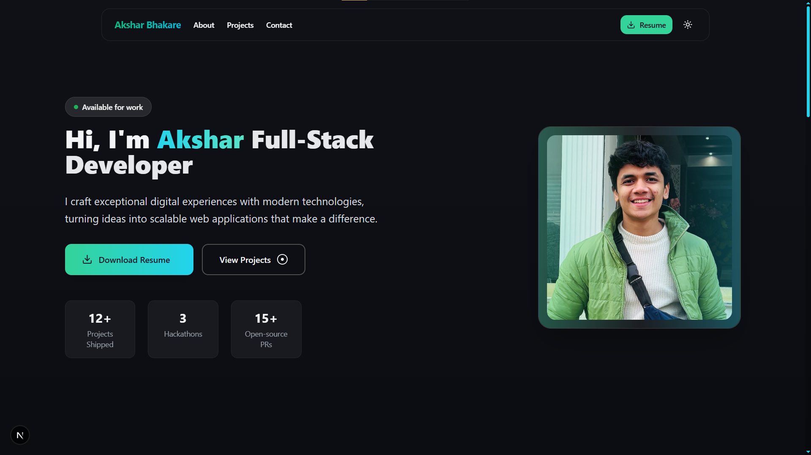

# Akshar Bhakare - Portfolio Website

A modern, responsive portfolio website built with Next.js, featuring smooth animations, dark/light mode, and a clean design.

## 🚀 Features

- **Responsive Design** - Optimized for all devices (mobile, tablet, desktop)
- **Dark/Light Mode** - Toggle between themes with smooth transitions
- **Smooth Animations** - Powered by Framer Motion
- **Modern UI** - Clean design with glassmorphism effects
- **Snap Scrolling** - Smooth section-to-section navigation
- **Contact Form** - Functional contact form with validation
- **Tech Stack Display** - Interactive technology showcase
- **Project Showcase** - Portfolio projects with live demos and code links

## 🛠️ Tech Stack

- **Framework**: Next.js 14 (App Router)
- **Styling**: Tailwind CSS
- **Animations**: Framer Motion
- **Icons**: Lucide React
- **Language**: TypeScript
- **Font**: Inter Tight

## 📱 Responsive Breakpoints

- **Mobile**: < 640px
- **Tablet**: 640px - 1024px
- **Desktop**: > 1024px

## 🎨 Design Features

- **Glassmorphism**: Backdrop blur effects
- **Gradient Animations**: Smooth color transitions
- **Micro-interactions**: Hover and focus states
- **Snap Scrolling**: Section-based navigation
- **Custom Scrollbar**: Themed scrollbar design

## 👤 Contact

**Akshar Bhakare**
- Email: aksharbhakare@gmail.com
- LinkedIn: [akshar-bhakare](https://www.linkedin.com/in/akshar-bhakare-ba6055292)
- Twitter: [@aksharbhakare](https://x.com/aksharbhakare)
- Location: Pune, Maharashtra, India

---

